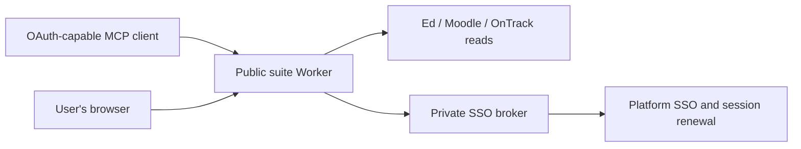

# Architecture and authentication

Learning MCP Suite runs as two Workers in the same Cloudflare account. The public Worker serves MCP, OAuth and account pages. The private broker handles Moodle / OnTrack sign-in and renewal through a Service Binding. Platform clients are bundled in the Workers; users install no connector or CLI.

## Authentication flows

| Flow                      | Purpose                                             | Renewal                                                                                                |
| ------------------------- | --------------------------------------------------- | ------------------------------------------------------------------------------------------------------ |
| Verified identity sign-in | Establish the suite account                         | A fresh provider SSO sign-in or verified Ed token restores the browser session.                        |
| MCP client OAuth          | Authorize a client to call suite tools as that user | `offline_access` enables suite OAuth refresh tokens. Revocation removes client access.                 |
| Platform connection       | Access that user's Ed, Moodle or OnTrack account    | Ed uses a user-supplied API token. Moodle and OnTrack have independent sessions renewed by the broker. |

Provider sign-in derives a suite account from the provider type, origin and verified stable user ID. The Okta adapter checks `/api/v1/sessions/me` in the provider's own browser origin and requires an active, unexpired session. It stores scoped SSO cookies and optionally encrypted credentials for the user's later platform connections. See Okta's [current-session guidance](https://developer.okta.com/docs/guides/oie-upgrade-sessions-api/main/). Ed sign-in retains its verified Ed identity anchor. Existing Moodle / OnTrack-based accounts retain their platform anchors and original login entry; provider sign-in creates a separate account and does not merge identities. Login uses a single-use, browser-bound nonce, exact Origin checks, a notice acknowledgement before credentials are processed, and a per-source attempt limit. A suite OAuth refresh token does not renew an OnTrack token or Moodle session. Existing tokens from another MCP service require their original issuer and grant storage; they do not authorize this suite.

Opening `/login` with a valid suite browser session returns directly to the requested connection or authorization page. It does not start another cloud browser or provider sign-in. If that browser session has expired, a new identity verification is required; saved SSO cookies remain available for the authenticated account's platform connections and renewal. Sign out before signing in as another account.

OAuth consent pages allow form redirects only to the current client's registered callback origin. Other pages retain `form-action 'self'`. This lets a native form return to the client after authorization without weakening Origin, CSRF, PKCE or single-use nonce checks.

## Connecting a course

1. The client authenticates through suite OAuth. The user reviews the notice and grants read or connection-management access.
2. `start_connection` creates an account-bound web link valid for ten minutes. The user enters platform credentials on that page, outside the chat. Users can also start at `/landing`.
3. The suite verifies each platform account and discovers current enrollments.
4. The client prepares `preview_course_bindings` from fresh discovery and shows the selected platforms, teaching period, location, warnings and changes to existing mappings. The user confirms once, then `confirm_course_bindings` saves the exact batch atomically. A failed or changed preview leaves existing mappings intact; retries return the original confirmation receipt. Any subset of platforms is valid; code or title similarity alone does not establish an association.
5. Read tools check enrollment and resource ownership before returning content to the client.

The mapping's course code is a user-confirmed label. Each source retains its platform identifier, so a standard code such as `CS101` can refer to a Moodle display identifier such as `CS101_S2_2026`. Display differences are shown for confirmation and do not override enrollment, object ownership or semester checks. Discovery proposes exact-code matches and generic display-prefix candidates; duplicate semesters, classes or competing matches require selection. It does not automatically save suggestions.

Batch replacement transfers only the selected platform links. Other platform links in an old mapping are retained unless the user explicitly replaces that mapping's key. Preview records are encrypted, account-bound and expire with discovery, no later than ten minutes. Confirmation checks both the enrollment snapshot and current registry again, preventing stale or concurrent edits from silently changing the reviewed plan.

## Platform sessions

**Moodle:** the broker keeps a cookie jar scoped by domain, path and expiry. It tries `core_session_touch` and then verifies a fresh dashboard and platform identity, obtaining the current `sesskey`. The `sesskey` is a session-bound CSRF value, not an OAuth refresh token. Cookies rotated by HTTP responses are retained, including cookies needed alongside the session cookie. Delayed cookie updates cannot overwrite a newer session-cookie rotation.

**OnTrack:** cloud SSO captures the access token, its expiry and platform refresh cookies. Before the access token expires, the broker posts to `/api/auth/access-token` with those cookies and `delete_auth_token: false`. It requires a future expiry and the same username, and persists rotated refresh cookies. Refresh cookies remain in the private broker. Existing access tokens supplied manually can be verified, but do not supply refresh material themselves.

When HTTP renewal rejects a session, the broker can restore that user's saved SSO cookies or use their opted-in password and TOTP configuration. The broker uses Cloudflare Playwright and the deployed shared-auth login flow in `broker/shared-auth.ts`: password-first detection, username Enter fallback, TOTP generation, code-authenticator row selection, SAML handoffs and the original step waits. Each request uses a fresh browser context with scoped cookies and exact HTTPS request origins. Browser launch, sign-in and cleanup have bounded waits. A provider may require push approval, a passkey, device checks or another interactive challenge; test the actual flow before claiming compatibility.

Broker operations are serialized per user. Brief renewal reuse avoids duplicate exchanges, and failures trigger a one-minute per-platform backoff. An upstream outage is reported without immediately launching a browser sign-in. Automatic renewal is attempted when needed; the project has no scheduled keep-alive job.

## Storage and deletion

OAuth records use KV. Suite account state and broker state use separate per-user Durable Objects. Ed tokens, platform sessions, refresh cookies and opted-in passwords / TOTP configuration are encrypted using separate suite and broker keys. The operator can access these records using its keys. One-time MFA codes are transient.

| Action                       | Effect                                                                                                                                                              |
| ---------------------------- | ------------------------------------------------------------------------------------------------------------------------------------------------------------------- |
| Sign out of the account page | Ends that browser session.                                                                                                                                          |
| Revoke client access         | Invalidates that client's suite grant.                                                                                                                              |
| Forget saved sign-in         | Deletes the password, TOTP configuration and shared SSO browser cookies; retains connected platform sessions and OnTrack refresh cookies.                           |
| Disconnect a platform        | Deletes its credentials/session and renewal material, and removes its course associations. Disconnecting both broker platforms also deletes the shared SSO sign-in. |

Requested course data passes through the service and its hosting infrastructure to the authorized client. The notice explains this transfer before use. Platform content is untrusted source material. Attendance search returns text candidates with sources, dates and partial coverage; it does not submit attendance.

An output boundary redacts credential fields, credential-bearing link parameters and known session secrets from MCP text and structured results, including errors. Administration and broker connection metadata receive the same protection. Internal session contracts retain the credentials needed for platform reads and renewal, require broker authentication, and use noncacheable responses. The output boundary is scoped to one account/request and does not retain secrets globally.

Platform destinations are saved per user in the private broker. The suite reads the authenticated account’s sites before constructing clients and adapters; renewal and cookie rotation require the same saved destination. A user cannot replace a connected site without disconnecting it, which clears that platform’s associations and session material. New connections require a user-supplied base link; platform destinations have no deployment default.
